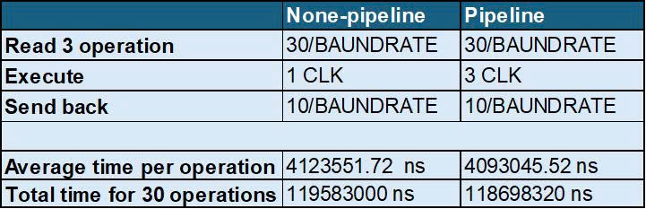

# Simple Calculator over UART using Verilog

This project implements a simple calculator module (`simple_caculator` and `simple_caculator_v2`) in Verilog that communicates via UART. A testbench (`tb_simple_caculator`) simulates the UART transmission of operands and operators, and verifies the response from the calculator module.
There are 2 versions: pipeline and non-pipeline.
## 🧮 Features

- Performs basic arithmetic operations: addition, subtraction, multiplication, division.
- Input/output communication via UART.
- Finite State Machine (FSM) handles the data flow.
- Configurable clock and baud rate.
- Testbench includes automatic transmission of test data.
- Two Calculator Architectures:
  - Non-Pipeline (`simple_calculator.v`)
  - Pipeline (`simple_calculator_v2.v`)

---

## 🗂️ Project Structure

```bash
.
├── uart
│   ├── uart.v             # UART transmitter/receiver module
│   └── tb_uart.v          # Testbench for UART module
├── alu
│   ├── ALU.v              # Arithmetic Logic Unit
│   └── tb_ALU.v           # Testbench for ALU
├── FIFO
│   ├── FIFO.v              # Queue Unit
│   └── tb_FIFO.v           # Testbench for queue
├── simple_caculator.v     # None-pipline Calculator module 
├── simple_caculator_v2.v     # Pipeline Calculator module
├── tb_simple_caculator.v  # Testbench for simulating calculator logic
└── README.md              # This documentation file
```

---

## ⚙️ Parameters

### `simple_caculator.v`
| Parameter     | Description                     | Default         |
|---------------|----------------------------------|-----------------|
| `WIDTH`       | Width of operands and result     | 8               |
| `CLK_FREQ`    | Clock frequency (Hz)             | 50000000        |
| `BAUD`        | Baud rate for UART               | 9600            |

### `tb_simple_caculator.v`
| Constant         | Description                            |
|------------------|----------------------------------------|
| `CLK_PERIOD`     | Clock period in ns (50MHz → 20ns)     |
| `BIT_DURATION`   | Duration of a UART bit (approx 104ns)  |

---

## 🔧 How It Works

## Non-pipeline version
- Receives an entire expression.
- Executes it sequentially.
- Starts the next operation only after the previous result is sent.
## Pipeline version
- Splits execution into stages (Fetch, Execute, Send back).
- Each stage processes a different operation in parallel.
- This allows overlapping work and reduces overall latency.


### Supported Operations
| Operator | Meaning         |
|----------|------------------|
| `+`      | Addition         |
| `-`      | Subtraction      |
| `x`      | Multiplication   |
| `/`      | Division         |

---


## 🚀 Performance Comparison
## In theory
- Pipeline need 6 time units for 4 request

- Non-pipline need 12 time units for 4 request

## In simulation (request 30 operations in testbench)
- Pipeline performance comparison table in test

- Difference in respone time of 2 modules (The time between calculations decreases)


## 🛠️ To-Do

- [ ] Add error handling and reporting (e.g., divide by zero).
- [ ] Extend to handle negative numbers and signed operations.
- [ ] Support for floating point (future work).
- [x] **Add pipelining to improve performance.**

---

## 🧑‍💻 Author

**Thach ViaSaNa**

---
